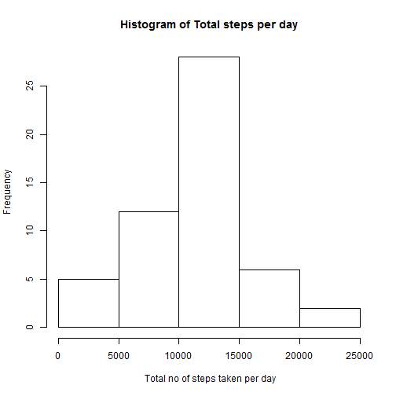
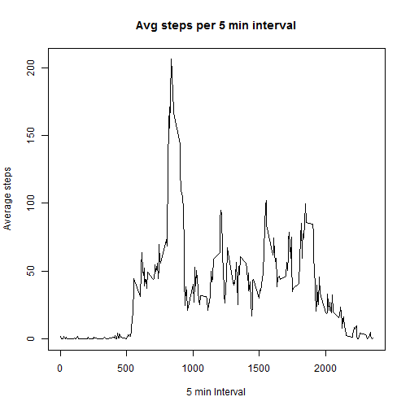
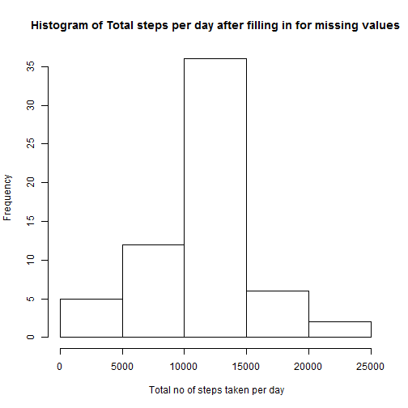
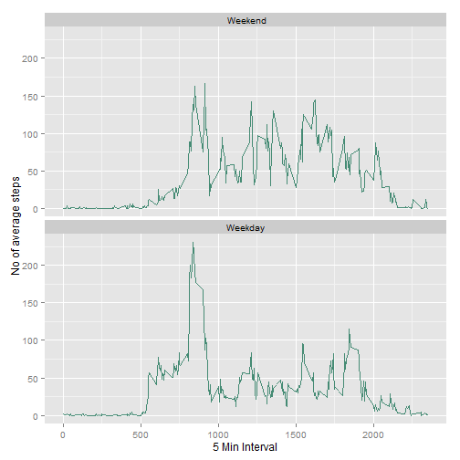

```r
#LOAD REQUIRED LIBRARIES
library(dplyr)
library(ggplot2)

#READ DATA FROM CSV FILE
read_dat<-read.csv("activity.csv")


#What is mean total number of steps taken per day?

## 1.Calculate total number of steps taken per day
steps_day<-read_dat %>%
  na.omit() %>%
  group_by(date) %>%
  summarize(totsteps=sum(steps)) %>%
  arrange(date)

##2. Make histogram of total number of steps
hist(steps_day$totsteps,xlab=" Total no of steps taken per day", ylab="Frequency",main="Histogram of Total steps per day")
```

 

```r
##3. Calculate and report the mean and median total number of steps taken per day
medianstep<- median(steps_day$totsteps)
meanstep<- mean(steps_day$totsteps)
print(medianstep)
```

```
## [1] 10765
```

```r
print(meanstep)
```

```
## [1] 10766.19
```

```r
#--------------------------------------------------------------------------------------------

#What is the average daily activity pattern?
##1.Make a time series plot  of the 5-minute interval (x-axis) and the average number of steps taken, averaged across all days (y-axis)
steps_interval<-read_dat %>%
  na.omit() %>%
  group_by(interval) %>%
  summarize(avgsteps=mean(steps)) %>%
  arrange(interval) 

plot(x=steps_interval$interval,y=steps_interval$avgsteps,type='l',xlab="5 min Interval", ylab="Average steps",main="Avg steps per 5 min interval")
```

 

```r
##2.Which 5-minute interval, on average across all the days in the dataset, contains the maximum number of steps?
steps_interval$interval[which(steps_interval$avgsteps==max(steps_interval$avgsteps))]
```

```
## [1] 835
```

```r
#-------------------------------------------------------------------------------------------
  
#Imputing missing values
  #1.Calculate and report the total number of missing values in the dataset
miss_val<-sum(is.na(read_dat$steps))
print(miss_val)
```

```
## [1] 2304
```

```r
#2.Devise a strategy for filling in all of the missing values in the dataset. The strategy does not need to be sophisticated. For example, you could use the mean for that 5-minute interval, etc.
#3.Create a new dataset that is equal to the original dataset but with the missing data filled in.

# join the actual data with the interval based step average
# use the interval based step average when it is equal to NA

s<-full_join(read_dat,steps_interval, by = "interval")
s$steps<-ifelse(is.na(s$steps),s$avgsteps,s$steps)

#Make a histogram of the total number of steps taken each day and Calculate and report the mean and median total number of steps taken per day. Do these values differ from the estimates from the first part of the assignment? What is the impact of imputing missing data on the estimates of the total daily number of steps?
## Calculate total number of steps taken per day

steps_day_new<-s %>%
  na.omit() %>%
  group_by(date) %>%
  summarize(totsteps=sum(steps)) %>%
  arrange(date)

## Make histogram of total number of steps
hist(steps_day_new$totsteps,xlab=" Total no of steps taken per day", ylab="Frequency",main="Histogram of Total steps per day after filling in for missing values")
```

 

```r
## Calculate and report the mean and median total number of steps taken per day
medianstep_new<- median(steps_day_new$totsteps)
meanstep_new<- mean(steps_day_new$totsteps)
print(medianstep_new)
```

```
## [1] 10766.19
```

```r
print(meanstep_new)
```

```
## [1] 10766.19
```

```r
summary(steps_day_new$totsteps)
```

```
##    Min. 1st Qu.  Median    Mean 3rd Qu.    Max. 
##      41    9819   10770   10770   12810   21190
```

```r
summary(steps_day$totsteps)
```

```
##    Min. 1st Qu.  Median    Mean 3rd Qu.    Max. 
##      41    8841   10760   10770   13290   21190
```

```r
#What is the impact of imputing missing data on the estimates of the total daily number of steps?
#ANSWER: Mean is the same, Median and Quartiles are different

#Are there differences in activity patterns between weekdays and weekends?
#ANSWER: Overall weekend activity is higher but both their trends  are similar 

s$day<-ifelse(weekdays(as.Date(s$date)) %in% c("Sunday","Saturday")," Weekend", "Weekday")

steps_interval_new<-s %>%
  na.omit() %>%
  group_by(interval,day) %>%
  summarize(avgsteps=mean(steps))
library(ggplot2)
ggplot(steps_interval_new, aes(interval,avgsteps))+geom_line(color="aquamarine4")+facet_wrap(~day, nrow=2)+labs(x="5 Min Interval", y="No of average steps")
```

 

